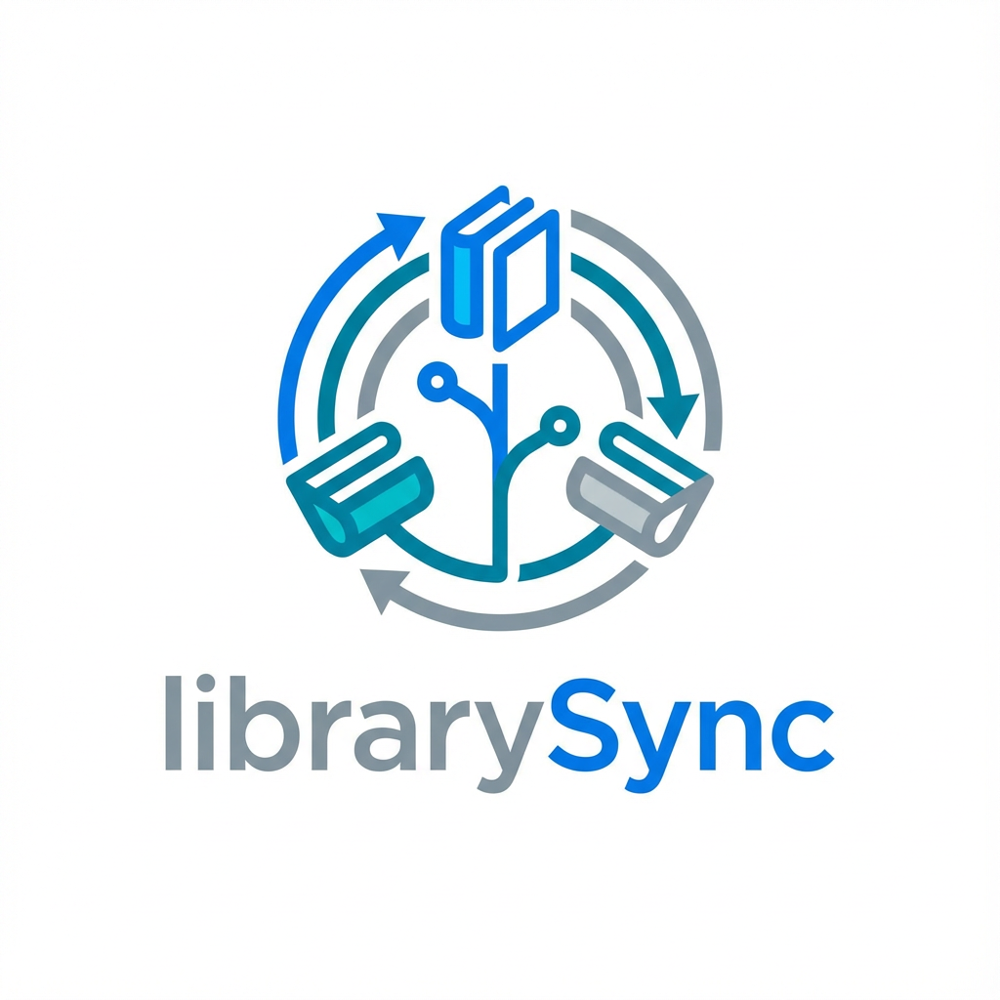

# librarySync

Self-hosted, Docker-compose-deployable sync hub for watch history and ratings across
multiple services. This project exists because I use multiple services and want to keep
my watch history in sync.

## What It Does

- Multi-user auth with JWT cookies and optional registration.
- Manual watch history (add/update/delete) with optional downstream deletion.
- Ratings support synced where supported.
- Imports from Trakt, SIMKL, Letterboxd, and Stremio (quick import + import all).
- Sync providers include Trakt, SIMKL, Letterboxd, Stremio, AniList, and PublicMetaDB.
- Outbox-based delivery with retries and per-user rate limiting.
- Metadata lookup and enrichment with TMDB, TVDB, IMDb, TVMaze, Kitsu, MyAnimeList, PublicMetaDB.
- Minimal web UI (static HTML + JS).

## Quick Start (Docker Compose)

1. Copy the env example:
   `cp .env.example .env`
2. Edit `.env` with your credentials and secrets.
3. Start:
   `docker compose up --build`
4. Open `http://localhost:8000`.

By default, `docker-compose.override.yml` is loaded and builds local images. To pull
the published images instead, run:
`docker compose -f docker-compose.yml up --pull=always`

## Environment Variables (Defaults)

All defaults below are from `.env.example`.

### Database
- `POSTGRES_DB` (default `librarysync`): database name for the Postgres container.
- `POSTGRES_USER` (default `librarysync`): database user for the Postgres container.
- `POSTGRES_PASSWORD` (default `librarysync`): database password for the Postgres container.
- `DATABASE_URL`
  (default `postgresql+psycopg://librarysync:librarysync@db:5432/librarysync`):
  SQLAlchemy connection string used by API/worker.

### App
- `LIBRARYSYNC_SECRET_KEY` (default `change_me`): encryption key for stored secrets.
  Change this in production.
- `LIBRARYSYNC_ADMIN_API_KEY` (default `your_admin_api_key`): required for admin endpoints.
- `LIBRARYSYNC_BASE_URL` (default `http://localhost:8000`): base URL for OAuth callbacks.
- `LOG_LEVEL` (default `INFO`): logging level.
- `HISTORY_LOOKBACK_DAYS` (default `30`): import-all lookback window (set `-1` for full history).
- `LIBRARYSYNC_JWT_ACCESS_TOKEN_MINUTES` (default `60`): access token lifetime.
- `LIBRARYSYNC_JWT_ALGORITHM` (default `HS256`): JWT signing algorithm.
- `LIBRARYSYNC_ALLOW_REGISTRATION` (default `true`): enable `/api/auth/register`.
- `LIBRARYSYNC_MAX_USERS` (default `1`): max number of registered users (`-1` for unlimited).

### OAuth
- `TRAKT_CLIENT_ID` (default `your_trakt_client_id`): Trakt OAuth app client ID.
- `TRAKT_CLIENT_SECRET` (default `your_trakt_client_secret`): Trakt OAuth app secret.
- `SIMKL_CLIENT_ID` (default `your_simkl_client_id`): SIMKL OAuth app client ID.
- `SIMKL_CLIENT_SECRET` (default `your_simkl_client_secret`): SIMKL OAuth app secret.

### Worker Modes
- `LIBRARYSYNC_WORKER_MODES` (default `all`): comma-separated list of worker loops.
  Options: `outbox`, `metadata`, `metadata_cache`, `quick_import`, `import_all`, `watchlist`.
- `LIBRARYSYNC_WORKER_OUTBOX_CONCURRENCY` (default `1`): outbox loop concurrency.
- `LIBRARYSYNC_WORKER_METADATA_CONCURRENCY` (default `1`): metadata loop concurrency.
- `LIBRARYSYNC_WORKER_METADATA_CACHE_CONCURRENCY` (default `1`): metadata cache loop concurrency.
- `LIBRARYSYNC_WORKER_QUICK_IMPORT_CONCURRENCY` (default `1`): quick import loop concurrency.
- `LIBRARYSYNC_WORKER_IMPORT_ALL_CONCURRENCY` (default `1`): import-all loop concurrency.

### Rate Limits (per user, per provider, per minute)
- `LIBRARYSYNC_TRAKT_RATE_LIMIT_PER_MINUTE` (default `60`).
- `LIBRARYSYNC_SIMKL_RATE_LIMIT_PER_MINUTE` (default `60`).
- `LIBRARYSYNC_LETTERBOXD_RATE_LIMIT_PER_MINUTE` (default `30`).
- `LIBRARYSYNC_STREMIO_RATE_LIMIT_PER_MINUTE` (default `120`).
- `LIBRARYSYNC_TMDB_RATE_LIMIT_PER_MINUTE` (default `150`).
- `LIBRARYSYNC_TVDB_RATE_LIMIT_PER_MINUTE` (default `150`).

### PublicMetaDB Rate Limits (per user, request-window based)
- `LIBRARYSYNC_PUBLICMETADB_RATE_LIMIT_MAX_REQUESTS` (default `300`).
- `LIBRARYSYNC_PUBLICMETADB_RATE_LIMIT_INTERVAL_SECONDS` (default `10`).
- `LIBRARYSYNC_PUBLICMETADB_BATCH_RATE_LIMIT_MAX_REQUESTS` (default `3`, reserved for `/api/batch` support).
- `LIBRARYSYNC_PUBLICMETADB_BATCH_RATE_LIMIT_INTERVAL_SECONDS` (default `1`, reserved for `/api/batch` support).

### Batch Sizes (for batch-capable providers)
- `LIBRARYSYNC_TRAKT_MAX_BATCH_SIZE` (default `750`): Maximum number of items per Trakt batch request.
- `LIBRARYSYNC_SIMKL_MAX_BATCH_SIZE` (default `750`): Maximum number of items per SIMKL batch request (limited by 20MB POST size).

## Integrations

### Letterboxd
Letterboxd unfortunately does not have a devleoper program to request API access. For personal use it is possible to extract the required information from the app. Special thanks to @dado3212 with https://github.com/dado3212/letterboxd-scripts/ for guidance on retrieving the `client_id` and `client_secret`.
> Letterboxd tip: users can paste an intercepted request as `curl` or `httpie` to extract the `client_id` and `client_secret`.

### Trakt/SIMKL

When configuring connected apps for Trakt and SIMKL, add your domain and callback URLs.
Example values (replace `example.com` with your domain):
- Trakt app URL: `https://example.com`
- Trakt redirect URI: `https://example.com/api/integrations/trakt/callback`
- SIMKL app URL: `https://example.com`
- SIMKL redirect URI: `https://example.com/api/integrations/simkl`

## Development (uv + Ruff)

1. Install Python 3.14 and `uv`.
2. Sync deps:
   - `uv sync`
3. Run API:
   `cd backend && uv run uvicorn librarysync.main:app --reload`
4. Run worker:
   `cd backend && uv run python -m librarysync.worker`
5. Lint:
   `uv run ruff check ./backend/`

If you’re using `docker compose` with the `scaled-workers` profile, `worker-metadata-cache`
is now available and will run the metadata cache loop (`LIBRARYSYNC_WORKER_MODES=metadata_cache`).

## Release

Use the release helper to bump the version in `backend/pyproject.toml`, tag,
and create a GitHub release.

Examples:
- `python scripts/release.py --patch`
- `python scripts/release.py 0.9.0 --no-release`

The release helper runs `ruff` and the unit tests before it commits.

`gh` must be installed and authenticated if you are creating a GitHub release.

## Static File Cache Invalidation

librarySync automatically handles browser cache invalidation for static assets (CSS and JavaScript) by appending version query parameters to their URLs.

- Static files are cached for 7 days by default
- When you update the version in `backend/pyproject.toml`, browsers will automatically fetch new files
- Example: `/static/core.js?v=0.4.3` becomes `/static/core.js?v=0.4.5` on version bump

No manual cache busting or build-time hash generation is needed.

## Credits

Thanks to @MunifTanjim with [https://github.com/MunifTanjim/stremthru.git](Stremthru) for the inspiration behind the
Stremio sync workflow.
